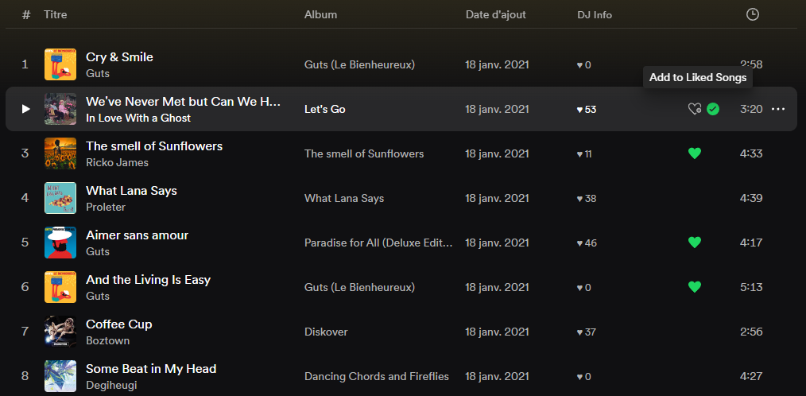

If you like this extension, please star the repository. It helps the extension's visibility in the marketplace and helps me measure how many people are using it.

# Old Like Button Extension

_This script adds the old like button next to the new "Add to Playlist" on tracklist rows_

I know that you can natively bring back the old Like button by disabling the Experimental Feature "Enable Aligned Curation", but I made this extension to have both buttons: the "Add to Liked Songs" one and the "Add to Playlist" one.

## Disclaimer
I'm pretty new to Spicetify but also to JS, so there might be some bugs / optimisable code. Please let me know!
I made this extension basing myself on [Quick Queue Extension](https://github.com/ohitstom/spicetify-extensions/blob/main/quickQueue/README.md), espicially for the rendering. Thanks to [ohitstom](https://github.com/ohitstom) for making those two extensions compatible.

## Installation

### Manual Installation

1. Install [Spicetify](https://spicetify.app) and set it up according to the instructions.
2. Navigate to your Spicetify config directory via the command `spicetify config-dir`.
3. Download oldLikeButton.js and place it in `/extensions`.
4. Run `spicetify config extensions oldLikeButton.js` and `spicetify apply` in terminal.

### Marketplace Installation

1. Install [Spicetify](https://spicetify.app) and set it up according to the instructions, including the marketplace installation
2. In the Extensions tab of the Marketplace page of your Spotify client, search `Old Like Button` and install it.
3. Restart your client if needed.

## Usage

Hover over tracklist row and click add/remove from Liked Songs.
